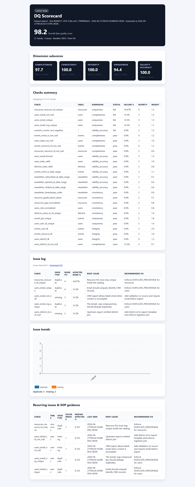
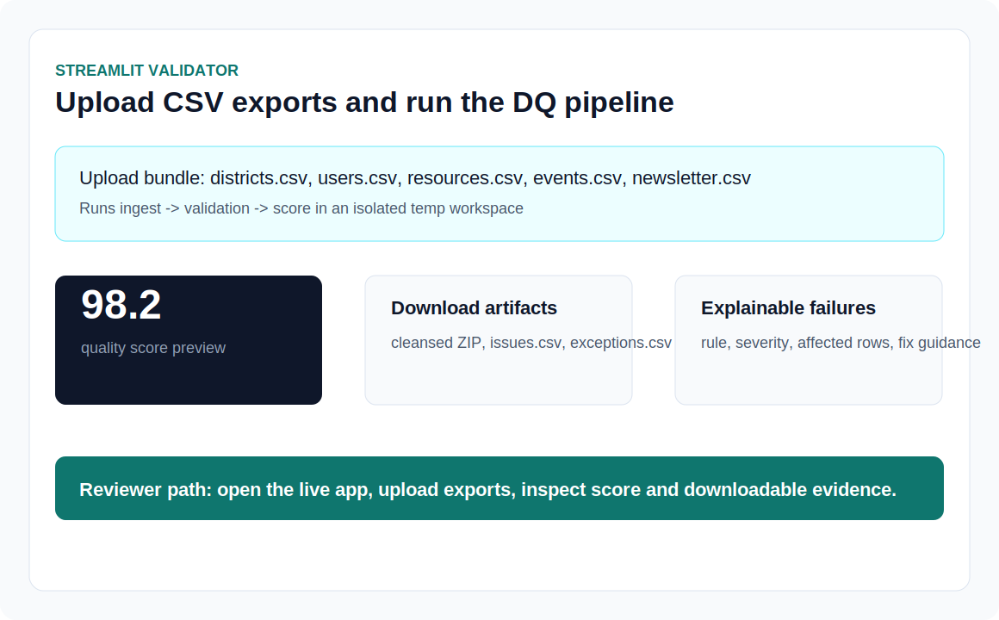
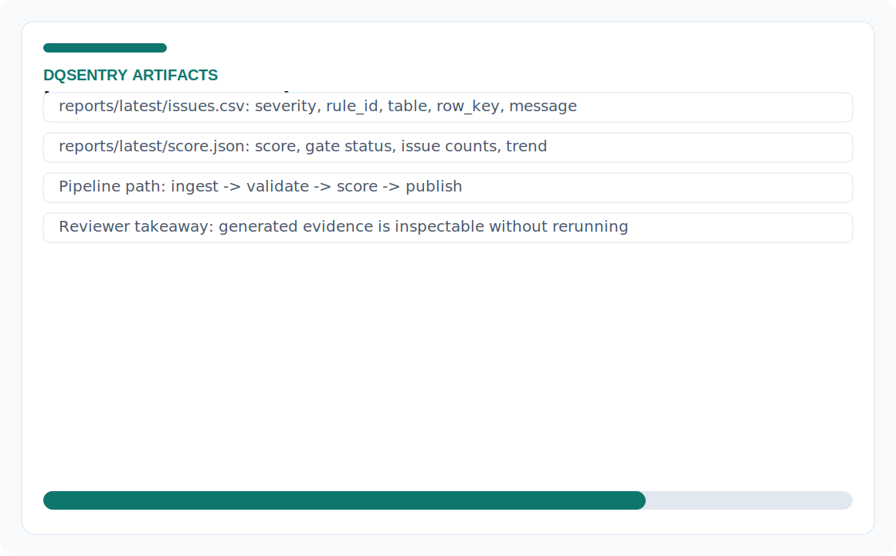
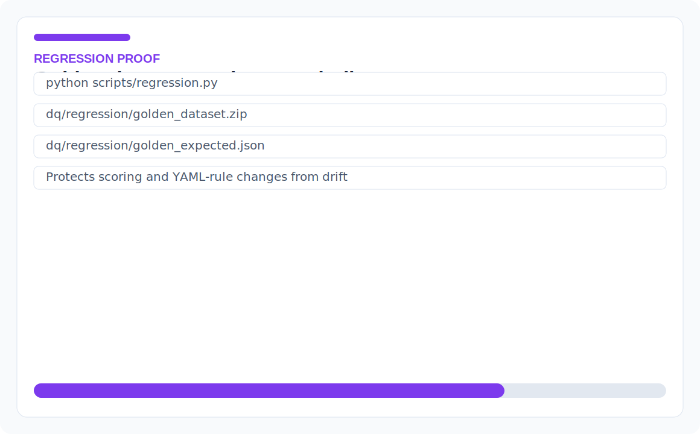

# DQSentry: Data Quality Sentinel

DQSentry is a Python data-quality platform that turns raw CSV exports into validated, scored, and explainable datasets. It ingests data into DuckDB, writes Parquet artifacts, runs Great Expectations checks, applies YAML-driven scoring rules, and publishes a scorecard with issue history. This project demonstrates data validation, pipeline automation, regression testing, reporting, and CI/CD workflows for data engineering, analytics engineering, QA automation, and internal tooling roles.

## Current project metrics

| Metric | Latest value |
|---|---:|
| Overall data quality score | See `reports/latest/project_metrics.json` |
| Automated validation checks | See `reports/latest/project_metrics.json` |
| Quality gate | See `reports/latest/project_metrics.json` |
| Critical failed checks | See `reports/latest/project_metrics.json` |
| Regression baseline | See `reports/latest/regression_metrics.json` |
| Coverage summary | See `reports/latest/coverage_summary.json` |
| Published artifacts | See `reports/latest/artifact_manifest.json` |

For a human-readable summary, open `reports/latest/employer_metrics.md`.

## Quick links
- **Live demo:** [GitHub Pages scorecard](https://josuejero.github.io/DQSentry/) and [Streamlit upload validator](https://dqsentry.streamlit.app/)
- **Screenshots:** [scorecard](docs/assets/screenshots/scorecard.png), [upload validator](docs/assets/screenshots/streamlit-validator.svg), [issues/score artifacts](docs/assets/screenshots/issues-score-artifacts.svg), [regression summary](docs/assets/screenshots/regression-summary.svg)
- **Test report:** `python scripts/regression.py` with `dq/regression/golden_dataset.zip` and `dq/regression/golden_expected.json`
- **CI workflow:** `.github/workflows/dq_push.yml`, `.github/workflows/dq_scheduled.yml`, `.github/workflows/pages.yml`
- **Architecture docs:** `docs/operational-guide.md`
- **Main code to inspect:** `scripts/ingest.py`, `scripts/validate_runner.py`, `scripts/score.py`, `dq/config/rules.yml`

## What to inspect first
- **Live scorecard:** start with `https://josuejero.github.io/DQSentry/` to see the latest quality score, issue summaries, trend context, and published reporting output.
- **Streamlit validator:** open `https://dqsentry.streamlit.app/` to upload CSV exports and run the same ingest→validation→score workflow interactively.
- **Pipeline code:** review `scripts/ingest.py`, `scripts/validate_runner.py`, and `scripts/score.py` to see how raw files become staged tables, validation results, and score artifacts.
- **Rules and scoring config:** inspect `dq/config/rules.yml` and `dq/config/quality_gate.yml` to understand the checks, severities, and pass/fail thresholds.

## Live experiences
- **Latest scorecard (GitHub Pages):** `https://josuejero.github.io/DQSentry/` keeps the newest run rendered via `reports/latest/` and published through `.github/workflows/pages.yml`.
- **CSV validator (Streamlit):** `https://dqsentry.streamlit.app/` lets anyone upload the five DQSentry exports (`districts`, `users`, `resources`, `events`, `newsletter`), runs the ingest→validation→score cycle in an isolated temp workspace, and surfaces downloads of cleansed tables, issue logs, and exception reports.

## Visual proof
| Scorecard | Upload validator |
| --- | --- |
|  |  |

| Issue and score artifacts | Regression summary |
| --- | --- |
|  |  |

## Directory & artefact layout
- `data/raw/<dataset>/<seed>` – source CSV/metadata exports. Never mutate these files; ingestion copies them into staging.
- `data/staging/<dataset>/<seed>` – DuckDB database (`staging.duckdb`), Parquet dumps, and metadata (`run_metadata.json`, `ingest_metadata.json`).
- `data/marts/` – persistence layers for checks (`dq_check_results`), issues (`dq_issue_log`, `dq_issue_history`, `dq_issue_recurrence`), run history, metrics/anomalies, schema drift, and score history.
- `dq/` – validation/domain logic (config, Great Expectations artifacts, anomaly/drift detectors) plus the Streamlit UI surface and regression data.
- `scripts/` – CLI entry points for ingestion, profiling, validation, scoring, publication, quality gate enforcement, regression, and reusable helpers.
- `reports/` – Jinja scorecard template (`templates/scorecard.html.jinja`), the `latest/` front door for GH Pages, and per-run archives under `runs/run_id=<id>`.
- `docs/operational-guide.md` – maintained companion documentation summarizing the operational workflow, artefacts, and automation.

## Getting started locally
1. `make setup` – boots a virtualenv (`.venv`), upgrades `pip`, installs dependencies (PyArrow needs `cmake` so install it first if missing), and prepares the tooling. This target calls `scripts/ensure_python_version.py` before the venv is created to enforce CPython 3.9–3.13 (PyArrow 18 only ships wheels for these releases), so install a compatible interpreter (pyenv/asdf, `python3.13`, etc.) if your system Python is newer.
2. `make sample` - generates deterministic synthetic exports via `tools/generate_synthetic.py` (or drop your own exports into `data/raw/<dataset>/<seed>`).
3. `make ingest` – copies CSVs into staging, canonicalizes values, writes DuckDB/Parquet, and persists metadata.
4. `make profile` – collects column statistics, writes profile Parquet artifacts, and drops `reports/runs/run_id=<id>/profile.html` for quick reviews.
5. `make validate` – runs `scripts/validate_runner.py`, then `scripts/score.py` to compute scores, issue previews, and writes `reports/latest/score.json` + `issues.csv`.
6. `make report` – renders the scorecard via `scripts/publish.py`, updates `reports/latest/index.html`, and archives the run under `reports/runs/run_id=<id>`.
7. `make run` – convenience target that executes sample generation, ingest, profile, validate, and report in sequence.

Run overrides: prepend `DATASET=<name> SEED=<seed>` to any `make` command or use the scripts directly (e.g., `python scripts/ingest.py --dataset-name custom --seed 7 --force`). Use `scripts/get_run_id.py --stage-path ...` when downstream commands need the run identifier.
> **Python compatibility:** `scripts/ensure_python_version.py` can also be run manually to double-check the interpreter. PyArrow 18 only publishes wheels for CPython 3.9–3.13, so `make setup` will abort if your default `python3` is 3.14+; install a supported release (e.g., `pyenv install 3.13.6`/`asdf install python@3.13.6` and `PYTHON=python3.13 make setup`) before continuing.

## Pipeline architecture
- **Ingestion:** `scripts/ingest.py` wraps `scripts/ingest_lib.ingest_dataset`, which applies `TABLE_SPECS`, mappings (`dq/config/mappings.yml`), custom timestamp parsing, and writes DuckDB tables + Parquet files. The ingest metadata becomes the source of truth for `run_id` and paths.
- **Profiling:** `scripts/profile_tables.py` gathers column metrics (via `scripts/profile_collector`), records profiles in `data/marts/profiles`, and exports an HTML summary for each run.
- **Validation & scoring:** `scripts/validate_runner.py` loads `dq/config/rules.yml`, evaluates each `CheckRule`, persists check/issue logs, updates run/issue history, triggers anomaly/drift detection, and hands off the results to `scripts/score.py`, which applies the penalty formula (`normalized_penalty = total_penalty / total_weight`, `score = max(minimum, baseline - 100 * normalized_penalty)`) and writes latest payloads plus historical snapshots.
- **Publication:** `scripts/publish.py` uses `scripts/publish_helpers.mutate_context` to enrich template context with issue trends, recurrence tables, and totals, renders `reports/templates/scorecard.html.jinja`, writes `reports/latest/index.html`, and archives the artifacts per run.
- **Gating & automation:** GitHub Actions pipelines (`.github/workflows/dq_push.yml` for pushes/PRs and `.github/workflows/dq_scheduled.yml` for nightly runs) orchestrate synthetic data generation, ingest → validate → score → publish, enforce `scripts/quality_gate.py` (default score ≥ 90 and no severity ≥ 5 failures), upload artifacts, and optionally publish to `gh-pages`.
- **Streamlit validator:** `dq/app/ui.py` powers the CSV validator via `dq/app/processing.run_validation_pipeline`, which stages uploads, runs the same ingest/validation pipeline, and returns downloads (cleaned dataset ZIP, issues CSV, exceptions CSV) plus score metrics.

## Documentation & exploration
- `docs/operational-guide.md` (this repository) summarizes live URLs, pipeline components, directories, automation, testing guidance, and extension points.
- Explore `reports/runs/run_id=<id>/` after each run for archived scorecards, issue logs, and the profile report.

## Testing & regression
- `python scripts/regression.py` uses `dq/regression/golden_dataset.zip` and `dq/regression/golden_expected.json` to guard scoring changes; rerun after modifying rules, weights, or thresholds (`--update-expected` refreshes the baseline when intentional).
- Streamlit validator keeps uploads isolated, so you can experiment without touching the tracked data mart.
